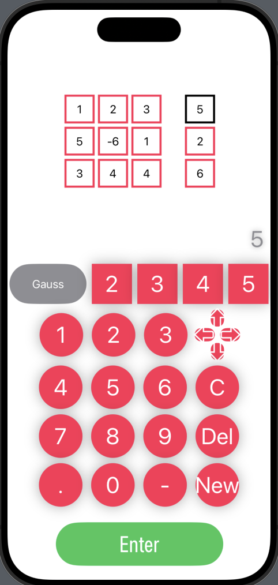
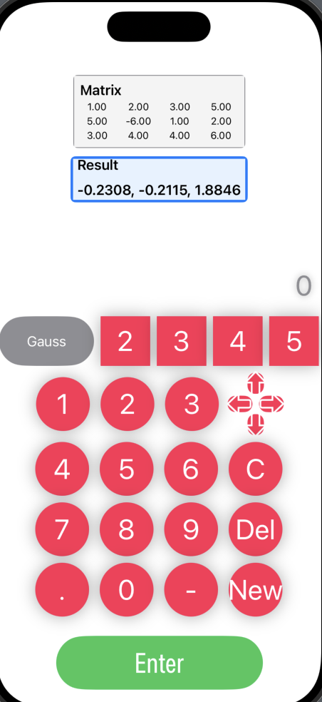

 

# Matrix Calculator: Gauss & Gauss-Jordan Methods

### Overview
This repository hosts the code for a sophisticated matrix calculator implemented in Swift, leveraging a C++ backend. It is designed to perform matrix calculations using the renowned Gauss and Gauss-Jordan elimination methods. This unique blend of Swift and C++ showcases an advanced approach to numerical computing on iOS platforms.

### Features
- **Matrix Operations**: Perform calculations on matrices using the Gauss and Gauss-Jordan elimination methods, widely used for solving linear equations.
- **Swift and C++ Integration**: A seamless integration of Swift's modern features with the robust computational abilities of C++.

### Implementation
- **Swift UI**: The user interface is built using SwiftUI, providing an intuitive and interactive experience for inputting matrices and displaying results.
- **C++ Backend**: The core computational logic, especially the implementation of Gauss and Gauss-Jordan methods, is handled by efficient C++ code.
- **Bridging Swift and C++**: A bridge between Swift and C++ is established, demonstrating an effective method of combining these two powerful languages.

### Usage
- Users can input matrices directly into the iOS app.
- Choose between Gauss and Gauss-Jordan methods for the calculation.
- View the results directly within the app.

### Building and Running
- Instructions on how to build and run the app are provided, including setting up the environment for Swift and C++ integration.

### Authors
- Brandon Yip
- Emil Levin
- Rahul Ramjeawon
- Stefan Magardino

